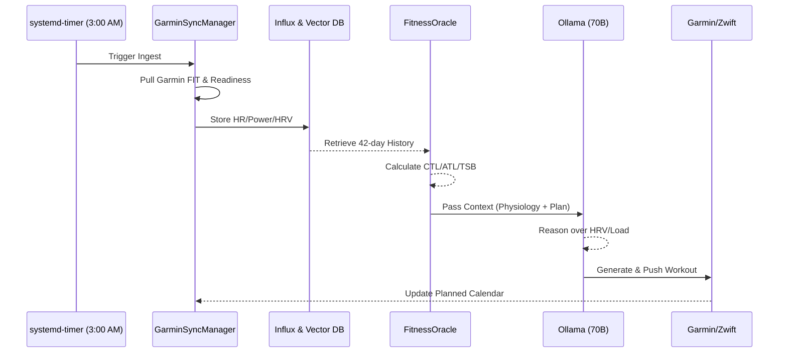

# **AI Coaching System**

Backend Architecture & Data Flow Design

---

## **1. Core Backend Components**

The system is designed as a series of isolated services coordinated by a Central Orchestrator. 

### **A. Data Ingestion Service (`backend/data_ingestion/`)**
- **GarminSyncManager**: Manages the `garmindb` pull (FIT files, SQLite/MySQL) and `garth` API for planned workouts and push actions.
- **TRExportManager**: Handles the one-time historical ingest of TrainerRoad workout descriptions and targets.

### **B. Storage & Persistence Layer (`backend/storage/`)**
- **InfluxClient**: The primary time-series engine. High-resolution HR, Power, and Pace data from FIT files are mapped to InfluxDB buckets.
- **SQLProxy**: A bridge to the `garmindb` SQLite/MySQL output for relational queries (activity lists, user profiles).
- **HistoryIndexer (RAG)**: Converts training blocks into embeddings stored in Chroma/Qdrant.

### **C. Analysis Engine (`backend/analysis/`)**
- **FitnessOracle**: Pure Python implementation of CTL/ATL/TSB and TSS/s-TSS calculations.
- **PhysiologyLab**: Jupyter-compatible modules for CSS extraction, HRV correlation, and environmental normalization.

### **D. Orchestrator (`backend/orchestration/`)**
- **DailyPipeline**: The "3 AM Clock". Coordinates sync -> index -> analysis -> LLM generation -> push.
- **ContextAssembler**: Combines state from InfluxDB, SQLProxy, and VectorDB into the final LLM prompt.

---

## **2. Data Storage Map (Pointers)**

*Edit the absolute paths below once your TrueNAS / local infrastructure is finalized.*

| Data Category | Storage Type | Recommended Pointer/Path | Actual Connection / Path |
| :--- | :--- | :--- | :--- |
| **FIT Files Archive** | Filesystem | `/mnt/data/garmin_archive/` | [TO BE FILLED] |
| **Time-Series DB** | InfluxDB 2.x | `http://truenas-ip:8086` | [TO BE FILLED] |
| **Vector Index** | Chroma (Local) | `./chroma_db/` | [TO BE FILLED] |
| **Relational DB** | SQLite / MySQL | `/mnt/data/garmin.db` | [TO BE FILLED] |
| **Workout Exports** | Filesystem | `./tr_workouts/` | [TO BE FILLED] |

---

## **3. Daily Execution Loop (The 3 AM Pattern)**

---

## **4. Error Handling & Reliability**

- **Auth Refresh**: `garth` tokens mapped to a persistent volume; auto-retry pull if unauthorized.
- **Batch Processing**: LLM generation is handled as a batch job (not real-time). Failures log to internal `logs/` for morning review.
- **Data Integrity**: InfluxDB writes are idempotent; duplicate FIT file ingestion is handled by `garmindb` source-of-truth.
